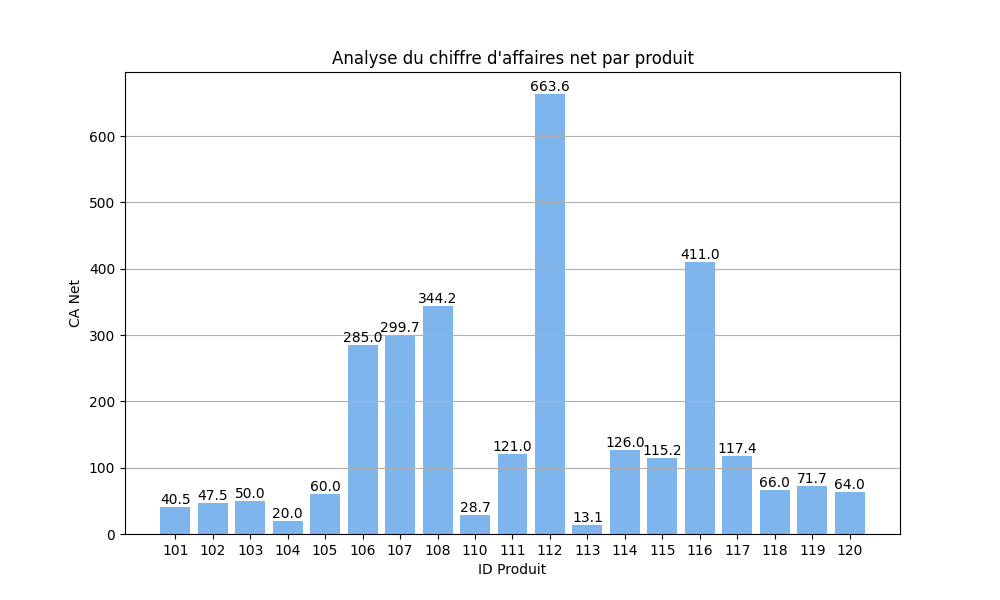
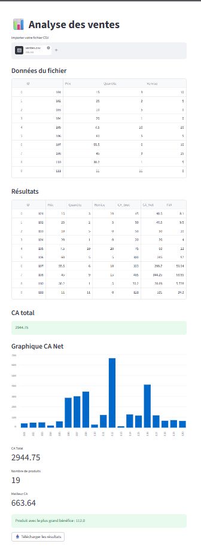

# Automatisation des Ventes
**Projet de Fin d'Année — Matière : Logiciels**

---

<p align="center">
  
</p>


## 🖇️ Description
Ce projet répond au besoin d’une entreprise de e-commerce dont le volume de données de ventes est devenu trop important pour être géré dans un tableur classique.
Un script Python a été développé pour automatiser la lecture du fichier CSV, effectuer les calculs financiers (chiffre d’affaires brut, net et TVA), identifier le produit le plus rentable, générer un fichier de résultats et proposer une visualisation graphique.

## 📍Objectif
Automatiser le traitement et l’analyse des données de ventes afin de gagner du temps, réduire les erreurs et faciliter la prise de décision.

---

## 📁 Structure du projet
```
automatisation-ventes/
│
├── ventes.csv
├── vente.py
├── app.py
├── resultats_final.csv
├── requirements.txt
├── image.png
├── Figure_1.png 
└── README.md
```
## 🌐 Cloner le projet (GitHub)
Le projet est disponible sur GitHub et peut être cloné pour une exécution locale.

## Prérequis : Configuration de Git
Avant de commencer, configurez votre identité Git :

```
git config --global user.name "Votre Nom"
git config --global user.email "votre-email@exemple.com"
```
### Étapes pour récupérer le projet avec VS Code
1. Ouvrir Visual Studio Code
2. Appuyer sur `Ctrl + Shift + P`
3. Taper : Git: Clone
4. Coller l’URL du dépôt GitHub :
```
https://github.com/naaaaaaaazz/automatisation-ventes 
```
5. Choisir un dossier de destination sur votre ordinateur
6. Cliquer sur Open pour ouvrir le projet dans VS Code

## ▶️ Installation et exécution
Le projet est disponible sur GitHub et peut être cloné pour exécution locale.

1. Créer un environnement virtuel :

```
python -m venv venv
```

2. Activer l’environnement :

```
venv\Scripts\activate
```

3. Installer les dépendances :

```
pip install -r requirements.txt
```

4. Lancer le programme :

```
python vente.py
```

## 📥 Données d'entrée  
Le fichier ventes.csv doit utiliser le point-virgule `;` comme séparateur et contient les informations suivantes :

```
ID;Prix;Quantite;Remise
101;15.0;3;10
102;25.0;2;5
...
120;80.0;1;20
```

- **ID** : Identifiant du produit  
- **Prix** : Prix unitaire  
- **Quantite** : Quantité vendue  
- **Remise** : Réduction (%)


## ⚙️ Fonctionnalités
1. Lecture du fichier csv `ventes.csv`
2. Calcul du **CA Brut** (Chiffre d’Affaires Brut) : `Prix × Quantité`
3. Calcul du **CA Net** (Chiffre d’Affaires Net) : `CA_Brut × (1 - Remise / 100)`
4. Calcul de la **TVA** (20%) : `CA_Net × 0.20`
5. Affichage du **CA Total** de l'entreprise `Somme de tous les CA Net`
6. Identification du **produit le plus rentable**
7. Génération d’un nouveau fichier `resultats_final.csv`
8. Affichage des résultats sous forme de tableau

## 🎯 Résultat attendu

Après exécution, le programme :
- Génère un fichier resultats_final.csv
- Affiche le chiffre d’affaires total
- Identifie le produit le plus rentable
- Affiche un graphique des ventes

## 📊 Visualisation
Le script affiche un graphique en barres des ventes (chiffre d’affaires net par produit).

<p align="center">
  
</p>

## 🌐 Dashboard interactif (Streamlit)

En complément du script Python, une interface graphique a été développée avec **Streamlit** afin de rendre l’analyse des ventes plus simple, rapide et interactive.

Ce dashboard fonctionne comme une **application web locale**, accessible via un navigateur.

---

### ⚙️ Fonctionnalités du dashboard

- 📥 Importation d’un fichier CSV depuis l’interface  
- 📊 Affichage des données sous forme de tableau  
- 📈 Visualisation graphique du chiffre d’affaires net  
- 📌 Affichage des indicateurs clés (KPI) :
  - Chiffre d’affaires total  
  - Nombre de produits  
  - Meilleur produit  
- 🏆 Identification automatique du produit le plus rentable  
- 📤 Téléchargement des résultats au format CSV  

---

### ▶️ Lancer le dashboard

Après installation des dépendances :

```
streamlit run app.py
``` 
### 📸 Aperçu du dashboard

💡 Capture d’écran après importation du fichier CSV et affichage des résultats
<p align="center">
  
</p>

## 📤 Fichier de sortie

Le fichier resultats_final.csv contient :
`ID;Prix;Quantite;Remise;CA_Brut;CA_Net;TVA`

## 🧠 Compétences mobilisées

* Programmation en Python
* Manipulation de fichiers CSV
* Analyse de données
* Visualisation avec Matplotlib
* Gestion d’environnement virtuel (venv)
* Utilisation de VS Code
* Débogage (Debug)
* Développement d’interface web (Streamlit)
* Git & GitHub

## ⭐ Bonus réalisés

✔️ Lecture dynamique des fichiers CSV
✔️ Visualisation graphique avec matplotlib

## 🔧 Gestion de version (Git)
Le projet a été versionné à l’aide de Git afin de suivre les modifications du code.

Commandes utilisées en local :
```
git init
git add .
git commit -m "Projet final"
```

## 👩‍💻 Auteurs

- **HOUAMI Molka**    
- **LOUATI Mariem**  
- **JAZZAR Emna**   

Projet réalisé en collaboration.


## 🎯 Conclusion

Ce projet permet d’automatiser l’analyse des données de ventes et de fournir une visualisation claire et interactive grâce à un dashboard développé avec Streamlit.

Il améliore la prise de décision en entreprise en réduisant le temps de traitement manuel et en facilitant l’interprétation des données.

